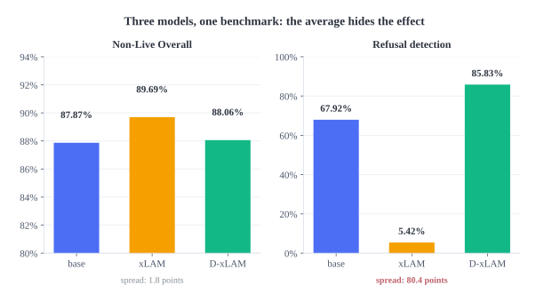
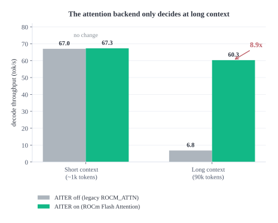
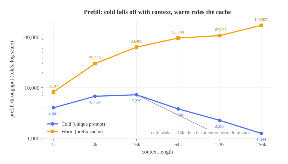
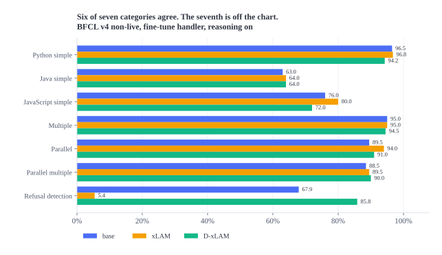
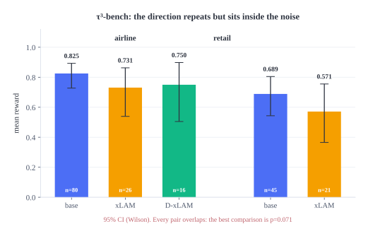

# qwen3.8-27b-finetune-eval

Fine-tuning, serving, and evaluating a 27B LLM on datacenter GPUs, with the negative results and
the broken harnesses left in.

The interesting part is not that a 27B model runs. It is what the evaluation found.

## The finding

Teaching a model to call tools can destroy its ability to know when **not** to call one.

| Model | Non-Live Overall | Refusal detection |
|---|---|---|
| Qwen3.8-27B (base) | 87.87% | 67.92% |
| + SFT on tool-calling data | **89.69%** | **5.42%** |
| + distillation on top | 88.06% | **85.83%** |

The aggregate score barely moved: 87.87, 89.69, 88.06. The average hid the effect completely.
Looking at a single sub-metric instead, the refusal rate swings **15x**.

The fine-tune that scored best overall was also the one that would answer a question with a tool
call instead of declining, which is the failure mode that matters most in an agent.

Full per-category table in [Results](#results), raw output in `results/bfcl/`.




## What was built


| Stage | What |
|---|---|
| **Train** | Five LoRA r16 adapters on Qwen3.8-27B: two SFT branches (tool-calling, instruction), then distillation on each of the three resulting branches, plus the base |
| **Serve** | vLLM on ROCm (1x AMD Instinct MI300X, 192 GB), LoRA modules loaded and swapped over the API, up to 262,144 tokens of context |
| **Evaluate** | BFCL v4 (non-live + multi-turn) and τ³-bench, plus a TTFT-by-context profile of the serving stack |

### The training matrix

The design is a 3x2 rather than "some fine-tunes I tried", because the question the finding raises
is whether distillation *specifically* repairs tool-calling damage or just helps generally. That
needs a branch that was never tool-calling-tuned.

| Adapter | SFT branch | Distillation | Benchmarked | Published |
|---|---|---|---|---|
| `oh` | OpenHermes-2.5 | no | no | [Hub](https://huggingface.co/nickzin/qwen3.8-27b-lora-oh) |
| `xlam` | xLAM-60k (tool calling) | no | **yes** | [Hub](https://huggingface.co/nickzin/qwen3.8-27b-lora-xlam) |
| `distill-base` | none (base) | yes | no | [Hub](https://huggingface.co/nickzin/qwen3.8-27b-lora-distill-base) |
| `doh` | OpenHermes-2.5 | yes | no | [Hub](https://huggingface.co/nickzin/qwen3.8-27b-lora-doh) |
| `dxlam` | xLAM-60k (tool calling) | yes | **yes** | [Hub](https://huggingface.co/nickzin/qwen3.8-27b-lora-dxlam) |

`distill-base` and `doh` are the controls for the headline result. They are trained and published
but were never benchmarked, because the GPU budget ran out first. That gap is real and it is
stated in [Limitations](#limitations).

## Training

All runs use Unsloth on a single MI300X, LoRA rank 16 (`lora_alpha=16`, `lora_dropout=0`),
`bf16=True`, learning rate 2e-4 with 10 warmup steps, `max_seq_length=2048`.

| Run | Dataset | Rows | Steps | Effective batch | Wall time |
|---|---|---|---|---|---|
| `xlam` | `Salesforce/xlam-function-calling-60k` | 6,000 | 240 | 16 (accum) | ~41 min |
| `oh` | OpenHermes-2.5 | 3,000 | 200 | 16 | ~1h54 (PEFT) |
| distill (x3) | `lordx64/reasoning-distill-kimi-k2-6-max-sft` | 1,500 | 240 | 8 | ~22 min each |

**The 4.7x that mattered most.** The `oh` run went through PEFT at roughly 26 s/step. Unsloth
brought the same workload to 5.4 s/step. Two separate bugs had blocked Unsloth:

1. `unsloth` must be imported **before** `unsloth_zoo`, or `UNSLOTH_IS_PRESENT` is missing later.
2. Unsloth's `fix_untrained_tokens` walks the embedding matrix looking for untrained tokens. With
   embeddings on the meta device it crashes. The documented workaround is a no-op stub.

**The merge bug.** `PeftModel.merge_and_unload()` produced a checkpoint **bit-identical to the
base model** for Unsloth-saved adapters. It looks like a successful merge and behaves like no
fine-tune at all, which silently invalidated two completed runs before it was caught. The
detection is numeric: `(W_merged - W_base)` must equal `scale * (B @ A)` within a few bf16 ulps.
`training/verify_merge.py` implements the check and `training/manual_merge.py` is the merge path
that was verified to work.

## Serving: 10x on the same GPU

The first working setup decoded at **4.3 tok/s** on a 104k-token conversation. The same session now
runs at **47 tok/s**, and the fix was configuration, not hardware.

| Lever | Effect |
|---|---|
| ROCm attention backend (AITER + `ROCM_AITER_FA`) | 6.8 → 50.3 tok/s at 90k context |
| CUDA graph mode (`FULL_DECODE_ONLY`, not `PIECEWISE`) | 20 → 65 tok/s on short prompts |
| One resident LoRA instead of five | +68% throughput |

Long context is where the attention backend decides everything: without it the model is fine on
short prompts and unusable past 30k tokens.



The launch configuration that produced those numbers:

```bash
vllm serve /models/qwen3.8-27b \
  --served-model-name qwen38-base \
  --enable-lora --max-lora-rank 16 --max-loras 1 \
  --enable-auto-tool-choice --tool-call-parser qwen3_xml \
  --max-model-len 262144 --gpu-memory-utilization 0.94 \
  --compilation-config '{"cudagraph_mode": "FULL_DECODE_ONLY"}'
# environment: VLLM_ROCM_USE_AITER=1, VLLM_ALLOW_RUNTIME_LORA_UPDATING=1
```

`--tool-call-parser qwen3_xml` is not optional. Qwen3.x emits a native XML dialect; with the
`hermes` parser, vLLM returns `tool_calls: null` silently and the model looks incapable of tool
use rather than misconfigured.

### Prefill cost by context length

Single stream, `max_tokens=1`, `stream=True`. Cold means a unique prompt, so the prefix cache
cannot serve the work.

| Context | Cold | Warm (prefix cache) | Cold TTFT |
|---|---|---|---|
| 1k | 4,001 tok/s | 8,197 tok/s | 0.21 s |
| 4k | 6,759 tok/s | 29,923 tok/s | 0.47 s |
| 16k | **7,229 tok/s** | 63,408 tok/s | 1.71 s |
| 64k | 3,804 tok/s | 95,784 tok/s | 12.96 s |
| 128k | 2,253 tok/s | 107,055 tok/s | 43.74 s |
| 256k | 1,244 tok/s | **170,827 tok/s** | 158.40 s |



Cold prefill peaks around 16k and falls off after that, which is the attention term showing up.
Warm prefill is limited by the cache rather than compute, and stays fast all the way to 256k.

## Results

### BFCL v4, non-live

Fine-tune handler, reasoning enabled, temperature 0.001, 16 threads, seed 300.

| Category | base | xLAM | D-xLAM |
|---|---|---|---|
| Python simple | 96.50% | 96.75% | 94.25% |
| Java simple | 63.00% | 64.00% | 64.00% |
| JavaScript simple | 76.00% | 80.00% | 72.00% |
| Multiple | 95.00% | 95.00% | 94.50% |
| Parallel | 89.50% | **94.00%** | 91.00% |
| Parallel multiple | 88.50% | 89.50% | **90.00%** |
| **Refusal detection** | 67.92% | **5.42%** | **85.83%** |
| **Non-Live Overall** | 87.87% | **89.69%** | 88.06% |



The base model additionally ran `multi_turn`: base 69.00%, long context 62.00%, missing function
65.50%, missing parameter 52.00%.

Item counts per category are in `results/bfcl/data_non_live.csv` (the BFCL's own scoring output).

### τ³-bench

τ³-bench runs multi-turn customer-service scenarios where the agent has to call tools across a
conversation and the outcome is scored against expected database state. It is a different shape of
test from BFCL: single decisions versus multi-step behaviour.

| Run | Domain | Trials | n | Mean reward |
|---|---|---|---|---|
| base | airline | 4 | 80 | **0.825** |
| xLAM | airline | 3 | 51 | 0.706 |
| base | airline | 3 | 54 | 0.852 |
| D-xLAM | airline | 3 | 16 | 0.750 |
| base | retail | 3 | 45 | 0.689 |
| xLAM | retail | 3 | 21 | 0.571 |



The direction repeats (base ahead of the tool-calling fine-tune in both domains, at both 3 and 4
trials) and it matches the BFCL finding. It does **not** reach significance: the best comparison
is z=1.81, p=0.071. See [Limitations](#limitations).

## What broke

Nine harness bugs, each found by disbelieving a number, each fixed with a reproducible script in
`evaluation/harness_fixes/`. Three that generalise:

- **The BFCL readiness probe sends no auth header.** Against an authenticated endpoint it gets 401
  forever, never raises `ConnectionError`, and spins. It had burned **341,062 requests** before it
  was noticed.
- **τ³ needs an LLM judge, and the judge is not configurable by flag.** Four internal models are
  hardcoded in `tau2/config.py` to external OpenAI and Anthropic endpoints. The judge call has no
  `try/except`, so a missing judge fails the whole task after three retries. It also needs the
  `openai/` provider prefix; without it LiteLLM rejects every call, and that surfaces as task
  failures rather than as a configuration error.
- **A physically impossible measurement.** A first pass reported 169,189 tok/s of prefill, which
  would require 9.4 PFLOPS on a GPU with a 1.3 PFLOPS peak. The bug was a fixed salt across
  repeats, so the prefix cache was serving the work and the counter was reporting cached tokens as
  fresh ones. Checking throughput against hardware peak is what caught it.

The full list, with symptoms and fixes, is in [`docs/FAILURES.md`](docs/FAILURES.md). It is the
most useful file in this repository if you plan to run these benchmarks yourself, because none of
these bugs announce themselves.

## Limitations

Stated plainly, because they change how the results should be read.

1. **The second benchmark does not reach significance.** On τ³-bench the best comparison lands at
   p = 0.071, which is 93% confidence, not 95%. It is supporting evidence, not proof. The BFCL
   result, with 200+ items per category, is the one worth quoting.
2. **Two branches are trained but not benchmarked.** `distill-base` and `doh` are the controls that
   would separate "distillation specifically undoes tool-calling damage" from "distillation helps
   generally". Until they run, the mechanism behind the headline finding is a hypothesis.
3. **The τ³ sample sizes are unequal.** Per-run timeouts truncated several blocks, so the
   comparisons are not paired and `n` differs between models. That weakens the test further.
4. **The refusal column comes from one benchmark.** BFCL measures it with 240 items. That is enough
   to see a 15x effect, not enough to characterize it finely.
5. **BF16 only, one hardware configuration, one seed.** No quantized comparison, no variance study
   beyond the trial counts reported above.

## What I would do differently

- **Run the controls first.** The two unmeasured adapters are the ones that would have made the
  finding explanatory instead of observational. Budget for the control before the arm you are
  excited about.
- **Set timeouts from a measured per-item cost, not an estimate.** A 90-minute cap truncated every
  block because it was derived from the fastest category in the suite.
- **Check every number against a physical limit before believing it.** Two of the nine bugs were
  caught that way and neither would have shown up in a review of the code.
- **Pin the harness.** Both benchmarks needed patches to produce correct numbers. Whoever runs this
  next should apply `evaluation/harness_fixes/` before trusting any output.

## Cost

| | |
|---|---|
| Credits | **$100** (AMD AI Developer Program) |
| Rate | ~$2/hour, one MI300X, 192 GB |
| Total GPU time | ~50 hours across provisioning, training, serving, and evaluation |

That budget is the direct cause of every "not benchmarked" and "not significant" in this README.
The trade was deliberate: spend the hours on making the serving stack fast and the evaluation
trustworthy rather than on more arms of the matrix.

## Repository layout

```
training/      LoRA training and the merge/verify tooling
serving/       vLLM launch script with the flags that matter, plus the toggle benchmark
evaluation/    Benchmarks, the prefill profiler, and the harness fixes
results/       Raw outputs: BFCL CSVs, τ³ simulation JSONs (gzipped), prefill profile, serving baselines
docs/          FAILURES.md (the bug log), METHODOLOGY.md, RECREATE.md
ops/           Provisioning and teardown for the cloud GPU instance
evals/         Working tree from the development phase, kept for provenance
```

The τ³ simulation logs under `results/tau3/` are stored gzipped: 47 MB of raw JSON compresses to
5.4 MB with no loss. Nothing in the repo reads them programmatically (the aggregator reads
`results/tau3-summary.json`), so decompress on demand:

```bash
gunzip -k results/tau3/final/*/results.json.gz
```

`evaluation/` holds the curated entry points, the ones the commands below use. `evals/` is the
scratch directory where the work actually happened, including the virtualenvs and upstream clones
(both gitignored). It is kept so the path from "first attempt" to "final script" is visible.

The adapters are on the Hugging Face Hub, not in git. See [`adapters/README.md`](adapters/README.md).

## Reproducing

```bash
# 1. Provision a GPU instance (1x MI300X, ROCm image), then point the tooling at it.
#    ops/set_ip.sh rewrites ~/.ssh/config, the serving config, and any stored session URLs.
bash ops/set_ip.sh <instance-ip>
#    Full step-by-step rebuild, including the environments, is in docs/RECREATE.md.

# 2. Serve the base model with LoRA support and the working attention backend
MAXLEN=262144 bash serving/serve_lora.sh

# 3. Fine-tune (Unsloth, LoRA r16)
python training/train_xlam_unsloth.py

# 4. Benchmark. Apply the harness fixes first, or the numbers will be wrong.
python evaluation/harness_fixes/fix_bfcl_readiness.py
python evaluation/harness_fixes/fix_bfcl_thinking.py
bash evaluation/run_bfcl.sh

# 5. Profile prefill cost across context lengths
PREFILL_BASE_URL=http://localhost:8000/v1 python evaluation/measure_prefill.py
```

Environment notes that cost real time to find, recorded so they cost you none:

- Load `unsloth` **before** `unsloth_zoo`, or `UNSLOTH_IS_PRESENT` is missing and training crashes
  with a meta-tensor error.
- Verify a LoRA merge at the weight level. See [Training](#training).
- On Python 3.13, τ³ needs `audioop-lts`; `audioop` was removed from the standard library.
- If TLS is intercepted locally (corporate proxy, security product), large uploads fail
  intermittently with `CERTIFICATE_VERIFY_FAILED` while small ones pass on retry. Using the OS
  certificate store (`truststore.inject_into_ssl()`) fixes it.

## Benchmarks used

- **BFCL v4** ([gorilla](https://github.com/ShishirPatil/gorilla)), Berkeley Function Calling
  Leaderboard. Installed as `bfcl-eval` and reported with its own scoring code.
- **τ³-bench** ([tau2-bench](https://github.com/sierra-research/tau2-bench)). Run unmodified except
  for the harness fixes documented above.

## Licenses

Code is MIT. The adapters inherit the terms of their training data, and two of them are
**non-commercial** because the xLAM dataset is CC-BY-NC-4.0. Full map in
[`LICENSES.md`](LICENSES.md).

## Acknowledgments

The GPU time was provided as credits from the **AMD AI Developer Program** (AMD Developer Cloud).
A single Instinct MI300X with 192 GB of HBM is not hardware most people get to experiment on, and
without that allocation this project would have been a much smaller exercise. Thanks to AMD for
the allocation.

The results, the methodology, and any errors in them are my own. AMD did not commission, review,
or endorse this work.
